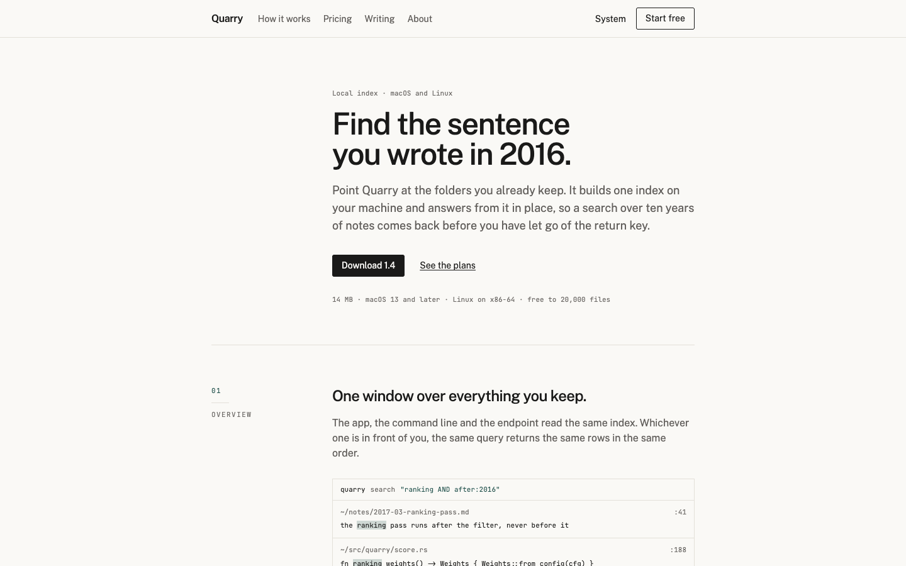

# Quarry

An Astro theme for a developer tool: a marketing site set with the discipline of a printed
technical reference. Free and MIT-licensed.

[Live demo](https://quarry-free.ondelva.com) · [Pro demo](https://quarry.ondelva.com)



## What it is

What fills the screen is rules and numbers rather than cards and shadows. Sections are numbered,
and the number hangs in the left margin while the section scrolls, so you always know where you
are reading. Density lives in one 38rem column — the hero, the pricing and the posts are all the
same width — and the rest of the page is left empty.

One accent colour, and it carries the numbers, the current position and the focus ring. Nothing
else is coloured. `--radius` is `3px`, and there is no same-width three-card grid anywhere in it.

## Features

- Astro 7 + Tailwind CSS v4, static output, zero client-side JS
- The marginal index: numbered section labels that stay in the margin, pure CSS
- Home, pricing, about, contact, privacy, terms and 404, all on one grid
- Writing: list, post, tag archives, pagination, feed, reading time
- Pricing from one JSON file, three plans, no client JavaScript
- Syntax colouring built from the theme's own colour tokens, so the contrast is measurable —
  `pnpm check:contrast` fails the build on a pair below WCAG AA
- Dark mode, responsive from 360px, no image assets to license
- Meta, Open Graph, JSON-LD, sitemap, `robots.txt`, and an analytics slot (Plausible, GA4, Umami)
- Lighthouse 100 on all four categories across the demo pages, checked in CI
- Type-safe content collections (Markdown and MDX), and `AGENTS.md` for Claude Code / Cursor

## Quick start

You need Node.js 22.12+ and pnpm 9 or newer (`npm i -g pnpm`). `package.json` pins the exact pnpm
version, and pnpm 10+ switches to it on its own.

```sh
pnpm create astro@latest my-site -- --template ondelva/astro-theme-quarry
cd my-site
pnpm install
pnpm dev
```

`pnpm dev` also serves `/styleguide`, where every colour token and type size is on one page. It is
a dev-only route and is not part of a build.

## Configure

Everything site-specific lives in `src/config.ts`: name, URL, navigation, the feature switches.
Colours, measures and spacing are tokens you override in `src/styles/theme.css`.

- [docs/customization.md](docs/customization.md) — every config group, the tokens, the switches
- [docs/content.md](docs/content.md) — the two collections and every field
- [docs/deploy.md](docs/deploy.md) — build, hosting, CI

## Deploy

Static output. Works on Cloudflare, Vercel, Netlify and GitHub Pages. One click and the host clones
this repository into your account, builds it and puts it online:

[](https://deploy.workers.cloudflare.com/?url=https://github.com/ondelva/astro-theme-quarry)
[](https://app.netlify.com/start/deploy?repository=https://github.com/ondelva/astro-theme-quarry)
[](https://vercel.com/new/clone?repository-url=https://github.com/ondelva/astro-theme-quarry)

Set `SITE_URL` to your address afterwards. See [docs/deploy.md](docs/deploy.md).

## Free vs Pro

This edition is a finished marketing site. Pro is what you buy the day the product needs a manual:
see it running at [quarry.ondelva.com](https://quarry.ondelva.com).

|                | Free (this repo)                                             | Pro                                                                           |
| -------------- | ------------------------------------------------------------ | ----------------------------------------------------------------------------- |
| Pages          | Home, pricing, blog set, about, contact, privacy, terms, 404 | + changelog, features, integrations, security, search                         |
| Documentation  | –                                                            | The whole documentation site: sidebar groups, contents, prev/next, edit links |
| Search         | –                                                            | Pagefind, one index over marketing pages, documentation and posts             |
| Code blocks    | Syntax colours from the theme's own tokens                   | + filename captions, marked lines, copy button, language tabs                 |
| Reference      | Markdown tables                                              | + parameter tables as data, callouts as a component                           |
| Pricing        | Three plans, one price each                                  | + monthly/yearly switch, comparison matrix                                    |
| Posts          | List, post, tags, feed, reading time                         | + series, author blocks, related reading                                      |
| Share cards    | One default image                                            | Drawn per post and per documentation page at build time                       |
| Colour presets | 1                                                            | 4                                                                             |
| License        | MIT                                                          | Commercial, unlimited end products                                            |
| Footer credit  | One line, easy to remove                                     | None                                                                          |
| Support        | GitHub Issues                                                | Email (im@ondelva.com), 2 business days                                       |

## Screenshots

More in [docs/screenshots/](docs/screenshots/): the home page, pricing and a post, light and dark,
desktop and mobile.

## License

MIT, see [LICENSE](LICENSE).
Third-party assets: [THIRD-PARTY-NOTICES.md](THIRD-PARTY-NOTICES.md)
